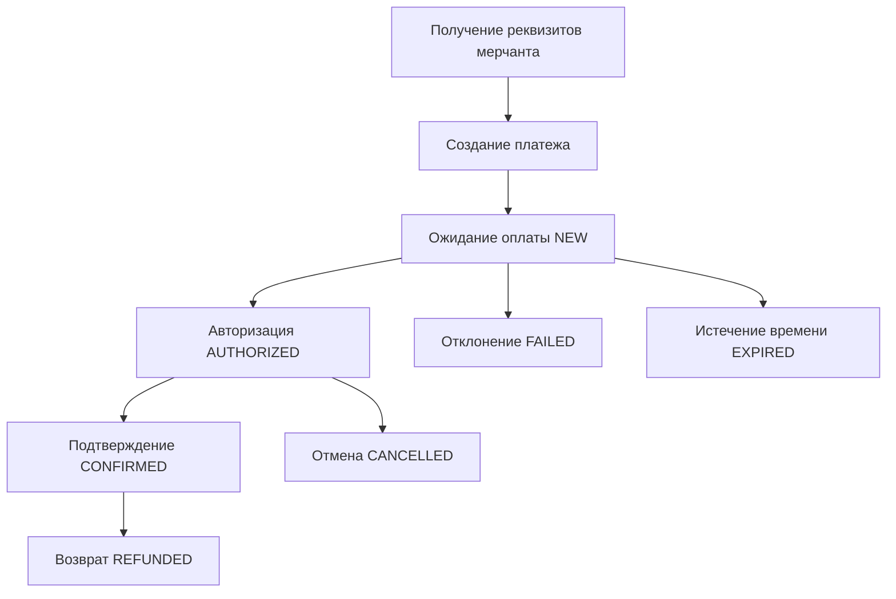

# Документация клиентского API платежного шлюза PaymentGateway

*Последнее обновление: 15 августа 2025 г. в 03:57*

## Оглавление

1. [Жизненный цикл платежа](#жизненный-цикл-платежа)
2. [Аутентификация](#аутентификация)
3. [Коды ошибок](#коды-ошибок)
4. [API эндпоинты](#api-эндпоинты)
5. [Примеры запросов](#примеры-запросов)

---

## Жизненный цикл платежа

Система поддерживает полный жизненный цикл обработки платежей с несколькими стадиями:

### Стадии платежа



### 1. Регистрация мерчанта (Команда организаторов это делает. Реквизиты доступны в [https://hub.hackload.kz](https://hub.hackload.kz))

- **Эндпоинт**: `POST /api/v1/TeamRegistration/register`
- **Назначение**: Регистрация нового мерчанта для приема платежей
- **Результат**: Получение учетных данных для API

### 2. Создание платежа

- **Эндпоинт**: `POST /api/v1/PaymentInit/init`
- **Назначение**: Создание нового платежного намерения
- **Статус**: `NEW`
- **Результат**: URL для оплаты покупателем

### 3. Обработка платежа

- **Процесс**: Покупатель вводит данные карты на платежной форме
- **Статус**: `NEW` → `AUTHORIZED`
- **Безопасность**: PCI DSS compliant обработка карточных данных

### 4. Подтверждение платежа

- **Эндпоинт**: `POST /api/v1/PaymentConfirm/confirm`
- **Назначение**: Подтверждение авторизованного платежа для списания средств
- **Статус**: `AUTHORIZED` → `CONFIRMED`

### 5. Проверка статуса

- **Эндпоинт**: `POST /api/v1/PaymentCheck/check`
- **Назначение**: Получение текущего статуса платежа
- **Поддержка**: Поиск по PaymentId или OrderId

### 6. Отмена платежа

- **Эндпоинт**: `POST /api/v1/PaymentCancel/cancel`
- **Назначение**: Отмена, реверс или возврат платежа
- **Типы**: Отмена (NEW), Реверс (AUTHORIZED), Возврат (CONFIRMED)

---

## Аутентификация

Система использует SHA-256 HMAC аутентификацию с защитой от повторных атак.

### Алгоритм генерации токена (УПРОЩЕННАЯ ВЕРСИЯ)

**Краткая формула**: `Token = SHA256(Amount + Currency + OrderId + Password + TeamSlug)`

#### Детальный алгоритм:

**ВАЖНО**: Система использует упрощенную схему аутентификации с **только 5 основными параметрами**.

1. **Сбор параметров**: Используются **только 5 обязательных параметров**:
   - ✅ **Amount** - сумма платежа в копейках
   - ✅ **Currency** - валюта платежа (например, "RUB")
   - ✅ **OrderId** - уникальный идентификатор заказа
   - ✅ **TeamSlug** - идентификатор команды. Указан как `MERCHANT_ID`
   - ✅ **Password** - пароль команды. Указан как `MERCHANT_PASSWORD`
   - ❌ **Исключаются**: ВСЕ остальные параметры (Description, Email, URLs, etc.)

2. **Добавление пароля**: К 4 параметрам запроса автоматически добавляется `Password` команды

3. **Фиксированный порядок**: Параметры **ВСЕГДА** используются в строгом алфавитном порядке:
   - **КРИТИЧНО**: `Amount` → `Currency` → `OrderId` → `Password` → `TeamSlug`
   - Этот порядок НЕ меняется независимо от порядка в JSON запросе

4. **Конкатенация значений**: Значения параметров конкатенируются без разделителей
   - Пример: `"19200" + "RUB" + "order-123" + "MyPassword123" + "my-team"`
   - Результат: `"19200RUBorder-123MyPassword123my-team"`

5. **SHA-256 хеширование**: К получившейся строке применяется SHA-256 с кодировкой UTF-8
   - Результат: строка в нижнем регистре (hex)

#### Важные особенности упрощенной схемы:

- **Только 5 параметров**: Все остальные параметры игнорируются при генерации токена
- **Фиксированный порядок**: Порядок всегда алфавитный, независимо от JSON
- **Без разделителей**: Значения конкатенируются напрямую
- **UTF-8 кодировка**: Используется для корректной обработки символов

#### Пример генерации токена:

```javascript
// Параметры запроса
const params = {
  amount: 19200,
  currency: "RUB",
  orderId: "order-123",
  teamSlug: "my-team"
};

// Пароль команды (из переменной окружения)
const password = "MyPassword123";

// 1. Собираем параметры в алфавитном порядке
const orderedParams = {
  amount: params.amount,
  currency: params.currency,
  orderId: params.orderId,
  password: password,
  teamSlug: params.teamSlug
};

// 2. Конкатенируем значения
const tokenString = Object.values(orderedParams).join('');

// 3. Генерируем SHA-256 хеш
const token = sha256(tokenString);

// Результат: токен для отправки в запросе
```

---

## Коды ошибок

### Основные коды ошибок

| Код | Описание | Действие |
|-----|----------|----------|
| `1000` | Успешная операция | Операция выполнена успешно |
| `1001` | Неверный токен аутентификации | Проверить алгоритм генерации токена |
| `1002` | Неверные реквизиты мерчанта | Проверить TeamSlug и Password |
| `1003` | Неверный формат запроса | Проверить структуру JSON |
| `1004` | Неверная сумма платежа | Сумма должна быть положительным числом |
| `1005` | Неверная валюта | Поддерживаются: RUB, USD, EUR, KZT |
| `1006` | Неверный OrderId | Проверить формат и уникальность |
| `1007` | Платеж не найден | Проверить PaymentId или OrderId |
| `1008` | Операция не разрешена | Проверить статус платежа |
| `1009` | Превышен лимит | Обратиться в поддержку |
| `1010` | Внутренняя ошибка сервера | Повторить попытку позже |

### Специфичные коды для операций

#### Создание платежа (PaymentInit)

| Код | Описание |
|-----|----------|
| `2001` | Неверный URL возврата | Проверить формат URL |
| `2002` | Неверный email | Проверить формат email |
| `2003` | Превышен лимит времени жизни платежа | Уменьшить paymentExpiry |

#### Подтверждение платежа (PaymentConfirm)

| Код | Описание |
|-----|----------|
| `3001` | Платеж не авторизован | Дождаться авторизации |
| `3002` | Сумма превышает авторизованную | Проверить сумму |
| `3003` | Платеж уже подтвержден | Проверить текущий статус |

#### Отмена платежа (PaymentCancel)

| Код | Описание |
|-----|----------|
| `4001` | Платеж не может быть отменен | Проверить статус |
| `4002` | Неверная причина отмены | Указать корректную причину |
| `4003` | Превышен лимит времени для отмены | Обратиться в поддержку |

---

## API эндпоинты

### Базовый URL

```
https://gateway.hackload.com
```

### Версионирование

Все эндпоинты используют версию `v1` в пути: `/api/v1/...`

### Общие заголовки

```
Content-Type: application/json
Accept: application/json
```

### 1. Создание платежа (PaymentInit)

**Эндпоинт**: `POST /api/v1/PaymentInit/init`

**Описание**: Создает новый платеж и возвращает URL для оплаты.

**Тело запроса**:
```json
{
  "teamSlug": "your-team-slug",
  "token": "generated-token",
  "amount": 19200,
  "currency": "RUB",
  "orderId": "order-123",
  "description": "Оплата билетов",
  "successURL": "https://your-site.com/success",
  "failURL": "https://your-site.com/fail",
  "notificationURL": "https://your-site.com/webhook",
  "paymentExpiry": 3600,
  "email": "user@example.com",
  "language": "ru"
}
```

**Ответ (200 OK)**:
```json
{
  "success": true,
  "paymentId": "pay_123456789",
  "orderId": "order-123",
  "status": "NEW",
  "amount": 19200,
  "currency": "RUB",
  "paymentURL": "https://gateway.hackload.com/pay/pay_123456789",
  "expiresAt": "2025-08-15T18:00:00Z",
  "createdAt": "2025-08-15T17:00:00Z"
}
```

### 2. Проверка статуса платежа (PaymentCheck)

**Эндпоинт**: `POST /api/v1/PaymentCheck/check`

**Описание**: Возвращает текущий статус платежа.

**Тело запроса**:
```json
{
  "teamSlug": "your-team-slug",
  "token": "generated-token",
  "paymentId": "pay_123456789"
}
```

**Или по OrderId**:
```json
{
  "teamSlug": "your-team-slug",
  "token": "generated-token",
  "orderId": "order-123"
}
```

**Ответ (200 OK)**:
```json
{
  "success": true,
  "payments": [
    {
      "paymentId": "pay_123456789",
      "orderId": "order-123",
      "status": "AUTHORIZED",
      "statusDescription": "Платеж авторизован",
      "amount": 19200,
      "currency": "RUB",
      "createdAt": "2025-08-15T17:00:00Z",
      "updatedAt": "2025-08-15T17:05:00Z",
      "expiresAt": "2025-08-15T18:00:00Z",
      "description": "Оплата билетов",
      "payType": "card"
    }
  ],
  "totalCount": 1,
  "orderId": "order-123"
}
```

### 3. Подтверждение платежа (PaymentConfirm)

**Эндпоинт**: `POST /api/v1/PaymentConfirm/confirm`

**Описание**: Подтверждает авторизованный платеж для списания средств.

**Тело запроса**:
```json
{
  "teamSlug": "your-team-slug",
  "token": "generated-token",
  "paymentId": "pay_123456789",
  "amount": 19200,
  "description": "Подтверждение оплаты билетов",
  "receipt": {
    "email": "user@example.com",
    "phone": "+79001234567"
  },
  "data": {
    "bookingId": "booking-456",
    "eventId": "event-789"
  }
}
```

**Ответ (200 OK)**:
```json
{
  "success": true,
  "paymentId": "pay_123456789",
  "orderId": "order-123",
  "status": "CONFIRMED",
  "authorizedAmount": 19200,
  "confirmedAmount": 19200,
  "remainingAmount": 0,
  "currency": "RUB",
  "confirmedAt": "2025-08-15T17:10:00Z",
  "bankDetails": {
    "bankTransactionId": "bank_tx_123",
    "authorizationCode": "AUTH123",
    "rrn": "123456789012",
    "responseCode": "00",
    "responseMessage": "Approved"
  },
  "fees": {
    "processingFee": 192,
    "totalFees": 192,
    "feeCurrency": "RUB"
  },
  "settlement": {
    "settlementDate": "2025-08-16",
    "settlementAmount": 19008,
    "settlementCurrency": "RUB"
  }
}
```

### 4. Отмена платежа (PaymentCancel)

**Эндпоинт**: `POST /api/v1/PaymentCancel/cancel`

**Описание**: Отменяет, реверсирует или возвращает платеж.

**Тело запроса**:
```json
{
  "teamSlug": "your-team-slug",
  "token": "generated-token",
  "paymentId": "pay_123456789",
  "reason": "Отмена по инициативе клиента",
  "receipt": {
    "email": "user@example.com",
    "phone": "+79001234567",
    "taxation": "usn_income"
  },
  "force": false,
  "data": {
    "cancellationReason": "client_request",
    "operatorId": "operator_123"
  }
}
```

**Ответ (200 OK)**:
```json
{
  "success": true,
  "paymentId": "pay_123456789",
  "orderId": "order-123",
  "status": "CANCELLED",
  "cancellationType": "CANCELLATION",
  "originalAmount": 19200,
  "cancelledAmount": 19200,
  "remainingAmount": 0,
  "currency": "RUB",
  "cancelledAt": "2025-08-15T17:15:00Z",
  "bankDetails": {
    "bankTransactionId": "bank_tx_123",
    "originalAuthorizationCode": "AUTH123",
    "cancellationAuthorizationCode": "CANCEL123",
    "rrn": "123456789012",
    "responseCode": "00",
    "responseMessage": "Cancelled"
  },
  "refund": {
    "refundId": "refund_123",
    "refundStatus": "PROCESSING",
    "expectedProcessingTime": "1-3 business days",
    "refundMethod": "card",
    "cardInfo": {
      "cardMask": "****1234",
      "cardType": "VISA",
      "issuingBank": "SBERBANK"
    }
  },
  "details": {
    "reason": "Отмена по инициативе клиента",
    "wasForced": false,
    "processingDuration": "00:00:05"
  }
}
```

---

## Примеры запросов

### Полный пример создания платежа

```bash
#!/bin/bash

# Параметры
TEAM_SLUG="your-team-slug"
PASSWORD="your-password"
AMOUNT=19200
CURRENCY="RUB"
ORDER_ID="order-123"

# Генерация токена (упрощенная версия)
TOKEN_STRING="${AMOUNT}${CURRENCY}${ORDER_ID}${PASSWORD}${TEAM_SLUG}"
TOKEN=$(echo -n "$TOKEN_STRING" | sha256sum | cut -d' ' -f1)

# Создание платежа
curl -X POST "https://gateway.hackload.com/api/v1/PaymentInit/init" \
  -H "Content-Type: application/json" \
  -d "{
    \"teamSlug\": \"$TEAM_SLUG\",
    \"token\": \"$TOKEN\",
    \"amount\": $AMOUNT,
    \"currency\": \"$CURRENCY\",
    \"orderId\": \"$ORDER_ID\",
    \"description\": \"Оплата билетов на концерт\",
    \"successURL\": \"https://your-site.com/success\",
    \"failURL\": \"https://your-site.com/fail\",
    \"notificationURL\": \"https://your-site.com/webhook\",
    \"paymentExpiry\": 3600,
    \"email\": \"user@example.com\",
    \"language\": \"ru\"
  }"
```

### JavaScript пример

```javascript
const crypto = require('crypto');

class PaymentGateway {
  constructor(teamSlug, password) {
    this.teamSlug = teamSlug;
    this.password = password;
    this.baseUrl = 'https://gateway.hackload.com/api/v1';
  }

  generateToken(params) {
    // Собираем параметры в алфавитном порядке
    const orderedParams = {
      amount: params.amount,
      currency: params.currency,
      orderId: params.orderId,
      password: this.password,
      teamSlug: this.teamSlug
    };

    // Конкатенируем значения
    const tokenString = Object.values(orderedParams).join('');
    
    // Генерируем SHA-256 хеш
    return crypto.createHash('sha256').update(tokenString).digest('hex');
  }

  async createPayment(paymentData) {
    const token = this.generateToken(paymentData);
    
    const requestBody = {
      ...paymentData,
      teamSlug: this.teamSlug,
      token: token
    };

    const response = await fetch(`${this.baseUrl}/PaymentInit/init`, {
      method: 'POST',
      headers: {
        'Content-Type': 'application/json'
      },
      body: JSON.stringify(requestBody)
    });

    return response.json();
  }

  async checkPayment(paymentId) {
    const params = { paymentId };
    const token = this.generateToken(params);
    
    const requestBody = {
      teamSlug: this.teamSlug,
      token: token,
      paymentId: paymentId
    };

    const response = await fetch(`${this.baseUrl}/PaymentCheck/check`, {
      method: 'POST',
      headers: {
        'Content-Type': 'application/json'
      },
      body: JSON.stringify(requestBody)
    });

    return response.json();
  }
}

// Использование
const gateway = new PaymentGateway('your-team-slug', 'your-password');

gateway.createPayment({
  amount: 19200,
  currency: 'RUB',
  orderId: 'order-123',
  description: 'Оплата билетов',
  successURL: 'https://your-site.com/success',
  failURL: 'https://your-site.com/fail',
  notificationURL: 'https://your-site.com/webhook',
  paymentExpiry: 3600,
  email: 'user@example.com',
  language: 'ru'
}).then(response => {
  console.log('Payment created:', response);
});
```

### Python пример

```python
import hashlib
import requests
import json

class PaymentGateway:
    def __init__(self, team_slug, password):
        self.team_slug = team_slug
        self.password = password
        self.base_url = 'https://gateway.hackload.com/api/v1'
    
    def generate_token(self, params):
        # Собираем параметры в алфавитном порядке
        ordered_params = {
            'amount': params.get('amount'),
            'currency': params.get('currency'),
            'orderId': params.get('orderId'),
            'password': self.password,
            'teamSlug': self.team_slug
        }
        
        # Конкатенируем значения
        token_string = ''.join(str(v) for v in ordered_params.values())
        
        # Генерируем SHA-256 хеш
        return hashlib.sha256(token_string.encode('utf-8')).hexdigest()
    
    def create_payment(self, payment_data):
        token = self.generate_token(payment_data)
        
        request_body = {
            **payment_data,
            'teamSlug': self.team_slug,
            'token': token
        }
        
        response = requests.post(
            f'{self.base_url}/PaymentInit/init',
            headers={'Content-Type': 'application/json'},
            json=request_body
        )
        
        return response.json()
    
    def check_payment(self, payment_id):
        params = {'paymentId': payment_id}
        token = self.generate_token(params)
        
        request_body = {
            'teamSlug': self.team_slug,
            'token': token,
            'paymentId': payment_id
        }
        
        response = requests.post(
            f'{self.base_url}/PaymentCheck/check',
            headers={'Content-Type': 'application/json'},
            json=request_body
        )
        
        return response.json()

# Использование
gateway = PaymentGateway('your-team-slug', 'your-password')

payment_response = gateway.create_payment({
    'amount': 19200,
    'currency': 'RUB',
    'orderId': 'order-123',
    'description': 'Оплата билетов',
    'successURL': 'https://your-site.com/success',
    'failURL': 'https://your-site.com/fail',
    'notificationURL': 'https://your-site.com/webhook',
    'paymentExpiry': 3600,
    'email': 'user@example.com',
    'language': 'ru'
})

print('Payment created:', payment_response)
```

---

## Webhook уведомления

### Формат уведомления

```json
{
  "paymentId": "pay_123456789",
  "status": "CONFIRMED",
  "teamSlug": "your-team-slug",
  "timestamp": "2025-08-15T17:10:00Z",
  "data": {
    "orderId": "order-123",
    "amount": 19200,
    "currency": "RUB",
    "description": "Оплата билетов"
  }
}
```

### Статусы для уведомлений

- `NEW` - Платеж создан
- `AUTHORIZED` - Платеж авторизован
- `CONFIRMED` - Платеж подтвержден
- `CANCELLED` - Платеж отменен
- `FAILED` - Платеж отклонен
- `EXPIRED` - Время платежа истекло
- `REFUNDED` - Платеж возвращен

### Обработка webhook

```javascript
app.post('/webhook', (req, res) => {
  const { paymentId, status, teamSlug, timestamp, data } = req.body;
  
  console.log(`Payment ${paymentId} status changed to ${status}`);
  
  switch (status) {
    case 'CONFIRMED':
      // Обработать успешный платеж
      handlePaymentSuccess(paymentId, data);
      break;
    case 'CANCELLED':
    case 'FAILED':
      // Обработать неудачный платеж
      handlePaymentFailure(paymentId, data);
      break;
    default:
      console.log(`Unhandled status: ${status}`);
  }
  
  res.status(200).json({ received: true });
});
```

---

## Безопасность

### Рекомендации по безопасности

1. **Храните пароли в безопасном месте**
   - Используйте переменные окружения
   - Не храните в коде или конфигурационных файлах
   - Регулярно обновляйте пароли

2. **Валидируйте входящие данные**
   - Проверяйте все параметры запроса
   - Используйте HTTPS для всех запросов
   - Ограничивайте размер входящих данных

3. **Обрабатывайте ошибки безопасно**
   - Не раскрывайте внутреннюю информацию
   - Логируйте ошибки для отладки
   - Используйте стандартные HTTP коды ошибок

4. **Мониторинг и логирование**
   - Отслеживайте подозрительную активность
   - Логируйте все платежные операции
   - Настройте алерты для критических ошибок

### Тестирование

#### Тестовые данные

Для тестирования используйте:
- **Тестовая карта**: `4111111111111111`
- **Срок действия**: Любая будущая дата
- **CVV**: Любые 3 цифры

#### Тестовые сценарии

1. **Успешный платеж**
   - Создать платеж
   - Дождаться авторизации
   - Подтвердить платеж

2. **Неудачный платеж**
   - Создать платеж с неверными данными карты
   - Проверить обработку ошибки

3. **Отмена платежа**
   - Создать платеж
   - Отменить до авторизации
   - Проверить статус

---

## Поддержка

### Контакты

- **Техническая поддержка**: [support@hackload.kz](mailto:support@hackload.kz)
- **Документация**: [https://docs.hackload.kz](https://docs.hackload.kz)
- **Статус сервиса**: [https://status.hackload.kz](https://status.hackload.kz)

### Часто задаваемые вопросы

**Q: Как часто обновляется статус платежа?**
A: Статус обновляется в реальном времени. Webhook уведомления отправляются мгновенно.

**Q: Можно ли изменить сумму после создания платежа?**
A: Нет, сумма фиксируется при создании. Для изменения создайте новый платеж.

**Q: Как долго хранятся данные о платежах?**
A: Данные хранятся 7 лет согласно требованиям законодательства.

**Q: Поддерживаются ли частичные возвраты?**
A: Да, поддерживаются частичные возвраты для подтвержденных платежей.

**Q: Что делать при ошибке аутентификации?**
A: Проверьте алгоритм генерации токена и правильность реквизитов мерчанта.
